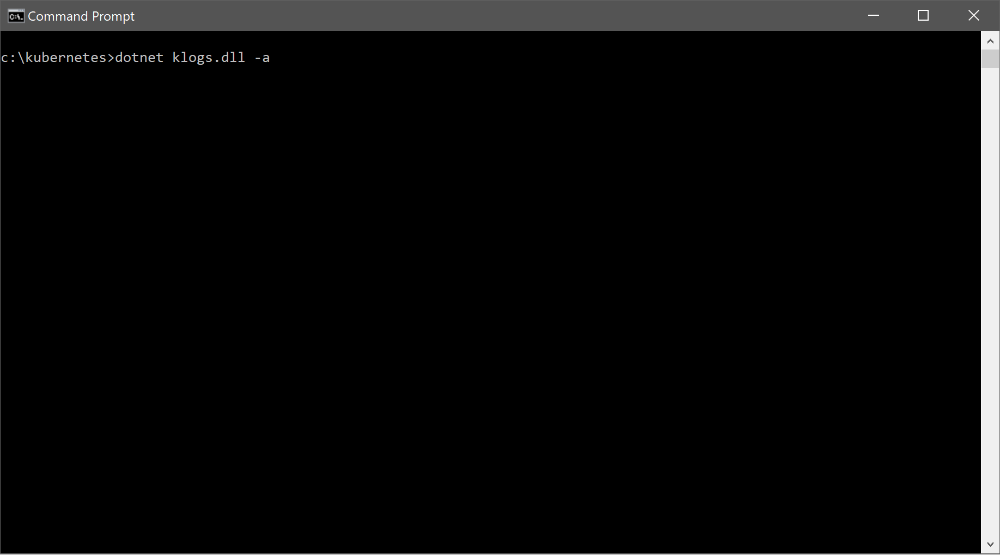

# klogs (Kubernetes Logs)
klogs, pronounced "kelloggs" like the cereal, is a tool that automates the dumping of various pieces of information about a Kubernetes cluster in order to support troubleshooting efforts with different issues being encountered. Many objects are supported, and this tool can run on any platform supported by Kubernetes and the .Net Core Framework.

Releases: [https://github.com/StevenJDH/klogs/releases](https://github.com/StevenJDH/klogs/releases)

## Features
* Dumps current and previous instance logs, descriptions with events, and anything else useful for troubleshooting.
* Supports for many objects such as pods, services, deployments, replicasets, statefulset, cronjob.batch, etc.
* Optionally dump logs to a Zip file instead of a folder for easier sharing.
* Cross-platform support for Linux, Windows, and macOS.

## Future features
* GUI mode once .NET Core 3.0 is released and I have time.
* Additional command line options.

## Prerequisites
* .NET Core 2.2+ runtime or SDK installed. Download it [here](https://dotnet.microsoft.com/download) for your OS version.

## Command line usage
Below is the usage information that is needed to run the program via the command line.

    Usage: dotnet klogs.dll [-a]

    Options:
      -a, -A         Archives the dumped logs to a Zip file.

## Disclaimer
klogs is distributed in the hope that it will be useful, but WITHOUT ANY WARRANTY; without even the implied warranty of MERCHANTABILITY or FITNESS FOR A PARTICULAR PURPOSE. See the GNU General Public License for more details.

## Do you have any questions?
Many commonly asked questions are answered in the FAQ:
[https://github.com/StevenJDH/klogs/wiki/FAQ](https://github.com/StevenJDH/klogs/wiki/FAQ)

## Need to contact me?
I can be reached here directly at [https://21.co/stevenjdh](https://21.co/stevenjdh "Contact Page")

## Want to show your support?

|Method       | Address                                                                                                    |
|------------:|:-----------------------------------------------------------------------------------------------------------|
|PayPal:      | [https://www.paypal.me/stevenjdh](https://www.paypal.me/stevenjdh "Steven's Paypal Page")                  |
|Bitcoin:     | 3GyeQvN6imXEHVcdwrZwKHLZNGdnXeDfw2                                                                         |
|Litecoin:    | MAJtR4ccdyUQtiiBpg9PwF2AZ6Xbk5ioLm                                                                         |
|Ethereum:    | 0xa62b53c1d49f9C481e20E5675fbffDab2Fcda82E                                                                 |
|Dash:        | Xw5bDL93fFNHe9FAGHV4hjoGfDpfwsqAAj                                                                         |
|Zcash:       | t1a2Kr3jFv8WksgPBcMZFwiYM8Hn5QCMAs5                                                                        |
|PIVX:        | DQq2qeny1TveZDcZFWwQVGdKchFGtzeieU                                                                         |
|Ripple:      | rLHzPsX6oXkzU2qL12kHCH8G8cnZv1rBJh Destination Tag: 2357564055                                        |
|Monero:      | 4GdoN7NCTi8a5gZug7PrwZNKjvHFmKeV11L6pNJPgj5QNEHsN6eeX3D &#8618;aAQFwZ1ufD4LYCZKArktt113W7QjWvQ7CWDXrwM8yCGgEdhV3Wt|

// Steven Jenkins De Haro ("StevenJDH" on GitHub)
